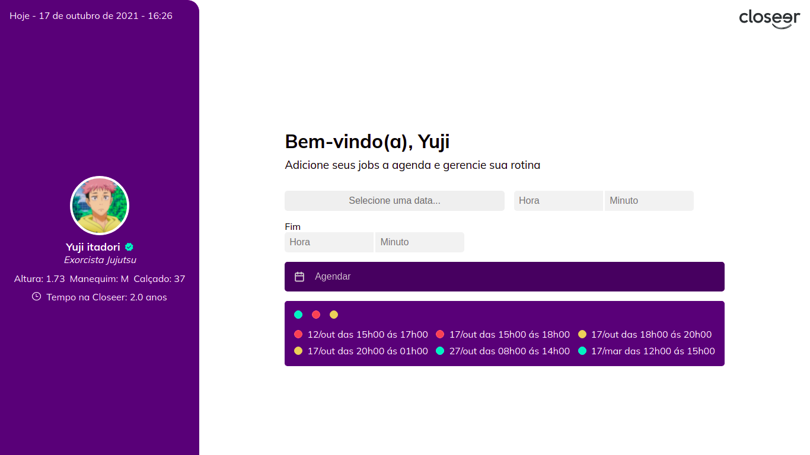

<p align="center">
  
</p>

<p align="center">
  
  
       

  
</p>

<h1 align="center">
    
</h1>

<br>

## 🧪 Technologies

This project was developed using the following technologies:

- [React](https://reactjs.org)
- [Firebase](https://firebase.google.com/)
- [TypeScript](https://www.typescriptlang.org/)

## 🚀 Getting started

Clone the project and access the folder.

```bash
$ git clone https://github.com/Luis-Felipe-N/closeer.git
$ cd closeer
```

Follow the steps below:
```bash
# Install the dependencies
$ yarn

# Start the project
$ yarn start
```
The app will be available for access on your browser at http://localhost:3000

## 🔖 Layout

You can view the project layout through the links below:

- [Layout Web](https://bit.ly/3AEcym7) 

Remembering that you need to have a [Figma](http://figma.com/) account to access it.

## 📝 License

This project is licensed under the MIT License. See the [LICENSE](LICENSE.md) file for details.

### Regras

- [x] Seguir interface proposta: https://bit.ly/3AEcym7

- [x] Os dados de Yuji devem ser consumidos de um arquivo .JSON, simulando o consumo de dados de uma API.

- [x] A agenda de Yuji apenas guarda as datas dos jobs do ano corrente, dessa forma, como
estamos no ano de 2021, a agenda não aceitará datas cujos anos sejam [...2018, 2019,
2020, 2022, 2023...]

- [x] Yuji é um pouco distraído e ganancioso e provavelmente tentará colocar vários jobs em uma mesma data - hora. Quando Yuji tentar fazer isso, um alerta deve ser exibido
informando que há um conflito e que Yuji já tem um job para aquela data - hora agendado,
afinal, Yuji não desenvolveu sua expansão de domínio para poder estar em dois lugares ao
mesmo tempo.

- [x] Ao adicionar um novo job na agenda, o formulário deve ser resetado, para estar pronto para uma nova inserção.

- [x] A cada novo job inserido, a listagem de jobs na agenda deve ser ordenada de forma cronológica.

- [x] Ao provocar um :hover nos círculos indicadores de categoria da agenda e de cada job, o Tooltip (um balão flutuante informativo) corresponde deve ser exibido.

- [x] O projeto deve ser construído utilizando React

---

<p align="center">Made with 💜 by Luis Felipe Nunes de Carvalho</p>